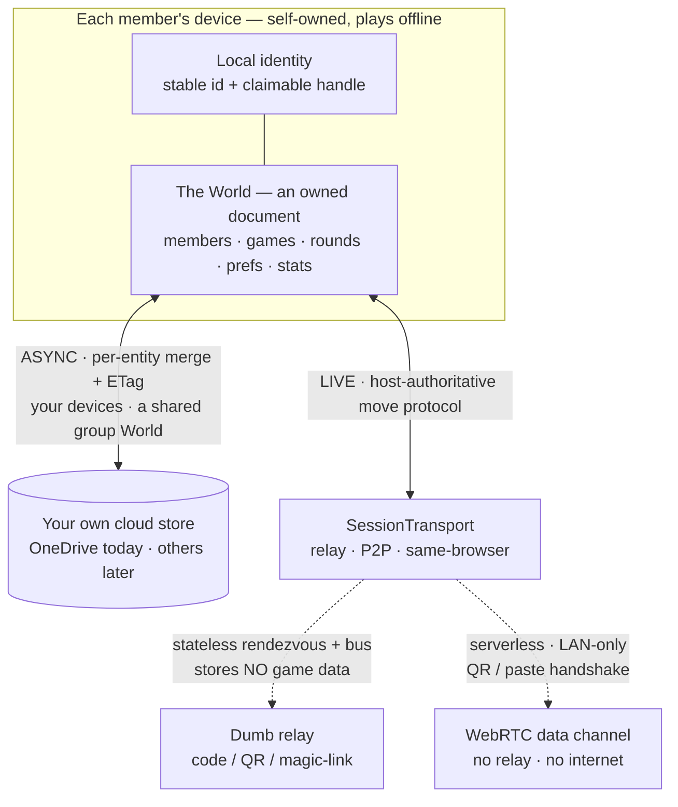

# Architecture

> How Score King grows from a local-first score pad into a portable, self-owned,
> identity-bearing **World** that can be shared and played live — without ever breaking the
> "open it and play, offline, no signup" promise.
>
> Companion docs: [PRODUCT.md](PRODUCT.md) (why & for whom) · [DESIGN.md](DESIGN.md) (visual
> system). This document is the **target architecture** we build toward; it is intentionally
> ahead of the code.

## Guiding principle

**An account, and the World it lives in, are local-first documents you _own_ — not a service
you log into.** Backup, sharing, and live multiplayer are capabilities *layered onto* an owned
document; none of them is ever a precondition for play. That single rule is what lets identity
and networked play exist without taxing the local-first trust contract.

## Core concepts

### The World

The single unit of ownership, and the evolution of today's backup file. One versioned
document holding **members, games, rounds, preferences, and stats**. "Single-device",
"shared", and "remote" are not different data models — they are only *where the World is
hosted and who may write to it.*

### Member — unifies "player" and "account"

One entity for "a gamer", replacing the old player-vs-account split:

- **Immutable `id`** — the stable identity; never changes.
- **Claimable handle** — a friendly auto-generated name (Xbox-style) the gamer can rename to
  claim. Display only; **never** an identity key.
- **Optional profile** — preferences, accessibility, stats.
- **Lifecycle** — a *guest* is `claimed: false, ephemeral: true`; *archive* soft-deletes and
  frees the handle for reuse; *promote* makes a member the device/party lead.

Rejoining matches on the `id` the joiner carries, never the mutable handle — so renaming or
reusing a handle can never impersonate or collide.

### Hosting modes

| Mode             | Where the World lives           | Writers                          |
| ---------------- | ------------------------------- | -------------------------------- |
| Local            | one device                      | that device                      |
| Shared (async)   | each member's own cloud store   | one at a time, merged on sync    |
| Live (real-time) | the leader's device is the truth | leader applies, others propose  |

## Change & merge model

**Per-entity last-writer-wins (LWW) with tombstones — deliberately _not_ event-sourcing.**

- Every record (member, game *including its settings*, round) carries `updatedAt` and a
  soft-delete tombstone.
- Sync = **union by `id`, newest wins per record.** Two members touching *different* things —
  one visits their own profile, another tweaks a game's settings — merge cleanly with no
  conflict. This is the common case, and it just works.
- Append-only rounds never conflict.

Why not a global op-log / event sourcing? The domain is append-mostly and low-churn; ordered
audit and undo are nice-to-haves, not the point of the app. Per-entity LWW delivers correct
*union* merge at a fraction of the cost, and builds directly on the existing JSON + ETag
backup: the **ETag stays as transport-level conflict _detection_**, and per-entity metadata
upgrades that detection into a real **merge**.

### Known limitation — intentional, for now

When two members edit **the same entity's** fields concurrently (both retune the *same* game),
LWW keeps one and silently drops the other. Accepted as the right 90/10 for a score app.

> **Deferred enhancement:** field-level merge for same-entity edits, plus a "here's what changed
> elsewhere" summary so a member can see — and repair — a clobbered tweak. Not built until real
> groups feel the pain.

## Live play

**Host-authoritative.** The party leader's World is the single source of truth for a live
session; members hold a live replica and send *intents* ("bid 3", "record round"); the leader
applies them and rebroadcasts. One real writer ⇒ no CRDTs and no merge in the hot path.
Leadership can transfer ("elect a new leader").

The live wire format is the **same mutation vocabulary** as the durable model — the move stream
is ephemeral propagation, not a second source of truth.

### Transport — a seam, not a fork

A single `SessionTransport` interface (sibling to the storage `SyncProvider`):

- **Relay first, peer-to-peer too** — the host-authoritative logic above it is unchanged as
  the transport swaps.
- Members join by **code / QR / magic-link**.
- First implementation is a **same-origin `BroadcastChannel`** transport (same-browser,
  multi-tab) — zero infrastructure, yet it exercises the whole host-authoritative engine.
  A `RelayTransport` (`src/lib/live/relay.ts`) drops in behind the same seam to add
  cross-device play, chosen in the one `makeTransport` factory when a relay URL is set. A
  `WebRtcTransport` (`src/lib/live/webrtc.ts`) drops in the same way for serverless same-room
  play — see **Nearby** below.

### The relay — dumb and stateless on purpose

The one piece of always-on shared infrastructure. It **resolves a join code to a session and
forwards messages — and stores no game data.** This keeps storage genuinely self-owned, keeps
cost and the privacy surface minimal, and keeps the centralized footprint to a stateless
message bus.

Shipped as deploy-ready code in **`relay/`** — a Cloudflare Worker + Durable Object (one DO
instance per join code) using Hibernatable WebSockets, so idle rooms cost nothing. It fans
each frame out to the *other* sockets in the room and never echoes the sender, matching the
`BroadcastChannel` semantics the engine relies on. Point the app at it with `VITE_RELAY_URL`
at build time or a per-device override in **Settings → Advanced → Live play relay URL**
(mirroring the OneDrive client-ID override). The hosted deployment + public URL is the
operator's call; the code is ready to `wrangler deploy`.

### Nearby — serverless, no relay, no internet

For same-room play with no infrastructure at all, a `WebRtcTransport` (`src/lib/live/webrtc.ts`)
sits behind the same seam. Devices connect directly over a **WebRTC data channel**; the one piece
that normally needs a server — exchanging connection descriptions (SDP) — is instead **hand-carried
between the devices in the room** as a QR code or copied text. `signal.ts` compacts that blob with
deflate + base64url so a whole offer/answer fits one scannable code. Peers use `iceServers: []`, so
only local-network candidates are gathered: nothing is relayed and no public address is discovered —
the connection simply won't leave the LAN.

The star maps cleanly because the live protocol is already **leader-centric** (guests only message
the leader; the leader broadcasts to all — never guest↔guest). The leader holds one peer connection
per guest, and the transport fans out / addresses frames and synthesizes disconnects, so
`onLeaderMessage` / `onGuestMessage` are reused untouched. Hosts add players from the game screen
(**📡 Play nearby**); guests join at **/nearby** by trading codes, then land in the same shared
`ReplicaBoard` as relay guests. Camera scanning (jsQR) and QR rendering (qrcode) are lazy-loaded, so
neither touches the core bundle.

## Guardrails — explicit non-goals

- **Accounts are local & optional** — never a login, never a precondition to play.
- **No global event log as the source of truth** — per-entity LWW is the right weight.
- **The relay never holds game data** — storage stays self-owned.
- **Never key identity off the mutable handle** — always the stable `id`.
- **No CRDTs for live concurrency** — host-authority removes the need.
- **Build P2P last, not first** — it dropped in behind the transport seam with no engine changes.

## Roadmap — soul first, infrastructure last

| Phase   | Adds                                                                                                       | Server?    |
| ------- | ---------------------------------------------------------------------------------------------------------- | ---------- |
| 0 ✅    | Faithful JSON World + ETag conflict *detection* + versioned envelope                                        | none       |
| 1 ✅    | Identity & World: Member model, claim / archive / promote, multiple members per device, active-member prefs | none       |
| 2 ✅    | Per-entity merge (`updatedAt` + tombstones, union-merge) → async shared Worlds, multi-device-you            | none       |
| 3a ✅   | Live co-play engine: host-authoritative `SessionTransport` seam + same-origin (`BroadcastChannel`) transport; join by code / link; record-round intents | none       |
| 3b ✅   | Cross-device live play: `RelayTransport` behind the same seam + a deploy-ready Cloudflare Worker/Durable Object relay (`relay/`) + join by QR — resolves a code, forwards messages, stores no game data | dumb relay |
| 4 ✅    | Nearby serverless co-play: `WebRtcTransport` behind the same seam — WebRTC data channels over a hand-carried QR / copy-paste handshake (`signal.ts`), LAN-only (`iceServers: []`), no relay and no internet | none       |
| later   | Field-level merge + a "what changed elsewhere" insight on async World sync                                  | none / relay |

Identity and merge — the self-owned, local-first core — land **before** the relay, so the
product's soul is real before any backend exists.
